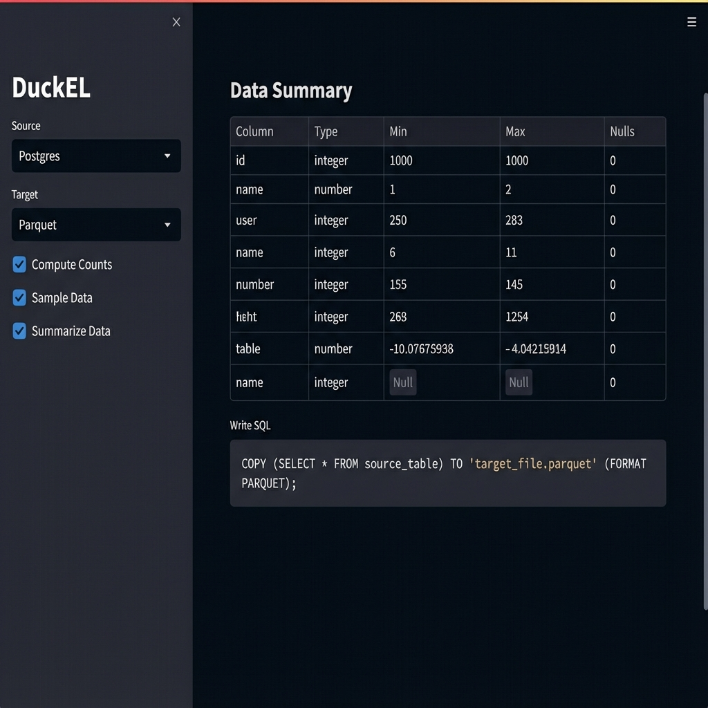

# DuckEL: DuckDB-powered Extract + Load POC


[](https://opensource.org/licenses/MIT)


DuckEL is a lightweight, high-performance Extract and Load (EL) tool powered by **DuckDB**. It demonstrates how to use DuckDB's engine to efficiently ingest data from various sources (Postgres, Snowflake, Parquet), perform lightweight processing (counting, sampling), and write the results to a target destination.



## Architecture

The following diagram illustrates the high-level data flow in DuckEL.

flowchart TD
    %% Use classes to style nodes
    classDef db fill:#e1f5fe,stroke:#01579b,stroke-width:2px;
    classDef file fill:#fff3e0,stroke:#e65100,stroke-width:2px;
    classDef core fill:#e8f5e9,stroke:#2e7d32,stroke-width:2px;
    classDef ui fill:#f3e5f5,stroke:#7b1fa2,stroke-width:2px,rx:10,ry:10;
    classDef ai fill:#fff,stroke:#ea4335,stroke-width:2px,stroke-dasharray: 5 5;

    User((🧑‍💻 User))

    subgraph App_Layer [Streamlit Application]
        direction TB
        UI[🖥️ Streamlit Frontend]:::ui
        Jules[🤖 Jules AI Assistant]:::ai
        Runner[⚙️ Pipeline Runner]:::core
    end

    subgraph Data_Sources [Source Layer]
        PG_Src[(🐘 Postgres)]:::db
        SF_Src[(❄️ Snowflake)]:::db
        PQ_Src{{📜 Parquet Files}}:::file
    end

    subgraph DuckDB_Engine [DuckDB Embedded Engine]
        Attach([🔗 Attach / Read])
        Compute([⚡ Count & Sample])
        Write([💾 Write / Copy])
    end

    subgraph Targets [Destination Layer]
        PG_Out[(🐘 Postgres)]:::db
        SF_Out[(❄️ Snowflake)]:::db
        PQ_Out{{📜 Parquet Files}}:::file
    end

    %% Interactions
    User -->|Config & Run| UI
    User -.->|Ask for Help| Jules
    Jules -.->|Suggest Pipeline| UI
    UI -->|Execute| Runner
    Runner -->|Orchestrate| DuckDB_Engine

    %% Data Flow
    PG_Src & SF_Src & PQ_Src ==> Attach
    Attach ==> Compute
    Compute ==> Write
    Write ==> PG_Out & SF_Out & PQ_Out

    %% Styling Logic
    linkStyle 5,6,7,8,9,10,11 stroke-width:3px,fill:none,stroke:#2e7d32;
    linkStyle 1,2 stroke-width:1px,stroke:#ea4335,stroke-dasharray: 3 3;

### Key Components

*   **Sources**: Data can be ingested from relational databases (**Postgres**, **Snowflake**) or Files (**Parquet**) residing on **S3** or the **Local Filesystem**.
*   **DuckDB Engine**:
    *   **Attach / Read**: Uses DuckDB's `ATTACH` feature or direct file reading to access source data without moving it entirely into memory.
    *   **Count & Sample**: Performs efficient metadata operations and data sampling.
    *   **Write / Copy**: Writes the data to the destination using standard SQL (`COPY`, `CREATE TABLE`).
*   **Targets**: Output can be directed back to databases or dumped as Parquet files (locally or to S3).

### Setup

1.  **Clone the repository**:
    ```bash
    git clone https://github.com/MrBisonte/quacknettor.git
    cd quacknettor
    ```

2.  **Install dependencies**:
    Using `pip` (modern pip uses pyproject.toml):
    ```bash
    pip install .
    ```
    Or strictly from requirements:
    ```bash
    pip install -r requirements.txt
    ```
    *Note: Ensure you have a working Python environment (3.9+).*

3.  **Configure Environment**:
    DuckEL uses environment variables for secure and flexible configuration. You must export the following variables before running the app or tests:

    ```bash
    export PG_USER=dbadmin
    export PG_PASSWORD=adminpwd123
    
    # If using Snowflake:
    export SF_ACCOUNT=xy12345.us-east-1
    export SF_USER=myuser
    export SF_PASSWORD=mypassword
    export SF_WAREHOUSE=compute_wh
    export SF_DATABASE=mydb
    export SF_SCHEMA=public
    ```

## Local Development (Postgres)

If you do not have a Postgres server, you can set one up locally (on macOS/Linux):

1.  **Install & Initialize**:
    ```bash
    brew install postgresql@14
    /opt/homebrew/opt/postgresql@14/bin/initdb -D pgdata -U dbadmin --auth=trust
    ```

2.  **Start Server**:
    ```bash
    /opt/homebrew/opt/postgresql@14/bin/pg_ctl -D pgdata -l pg.log start
    ```

3.  **Create Database**:
    ```bash
    /opt/homebrew/opt/postgresql@14/bin/createdb -h localhost -p 5432 -U dbadmin dbmain
    # (Optional) Set password explicitly if needed, though initdb auth=trust allows local access.
    ```

    export SF_SCHEMA=public
    ```

4.  **Verify Connections (Critical)**:
    Before running the main application, verify your connectivity and credentials using the provided test scripts.

    *   **Postgres**:
        ```bash
        python quacknettor/test_pg_connection.py
        ```
    *   **Snowflake**:
        ```bash
        python quacknettor/test_snowflake_connection.py
        ```

## Usage

Once connections are verified, you can run the main Streamlit application.

1.  **Run the App**:
    ```bash
    streamlit run app.py
    ```

2.  **Configure Execution**:
    -   **Source**: Select a data source (defined in `pipelines.yml`) from the "Source" dropdown.
    -   **Target**: Select a destination target from the "Target" dropdown.
    -   **Options**: Toggle "Compute Counts", "Sample Data", etc.

3.  **Run & Analyze**:
    Click "Run Pipeline" to execute the EL process. The app will display:
    -   Execution timings (Count, Sample, Write).
    -   A preview sample of the data.
    -   The generated SQL used for writing.

4.  **AI Assistant (Jules)**:
    Switch to the "AI Assistant" tab to ask **Google Jules** to help you generate pipeline configurations or debug issues.
    *Requires `JULES_API_KEY` to be set.*

## Deployment & Sharing

To share this application with others (e.g. for a POC), refer to [DEPLOY.md](DEPLOY.md).
It covers:
*   **Instant Sharing** via `ngrok`.
*   **Persistent Deployment** via Streamlit Community Cloud.
*   **Demo Mode**: Using the `demo_parquet_in` source for users without database access.

## Project Structure

*   `app.py`: Main Streamlit application entry point.
*   `pipelines.yml`: Configuration file defining source and target pipelines.
*   `duckel/`: Core logic package.
    *   `runner.py`: Orchestrates the pipeline execution.
    *   `engine.py`: Manages DuckDB connections.
    *   `adapters.py`: SQL generation logic for supported adapters.
*   `generate_data.py`: Utility script to create sample local Parquet data.
