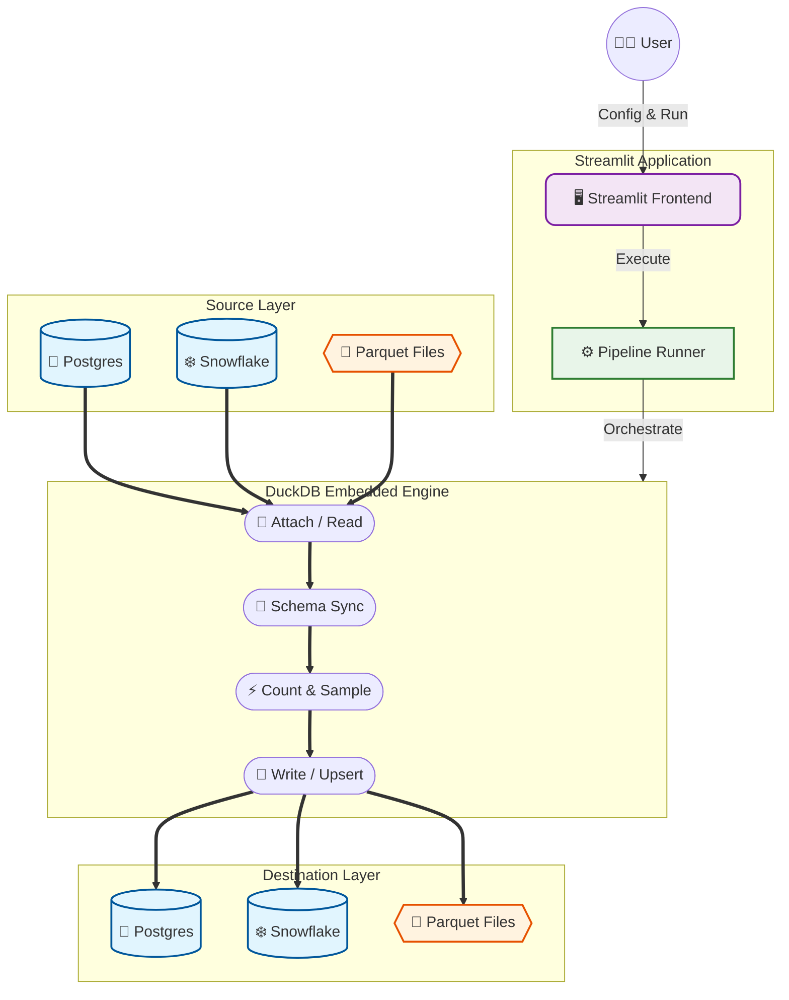

# duckEL

[](https://github.com/MrBisonte/quacknettor/actions/workflows/ci.yml)
[](LICENSE)
[](https://www.python.org/)

A lightweight, DuckDB-powered **Extract & Load (EL)** tool with **incremental loading**
(watermark / upsert) and **schema evolution** across Parquet, PostgreSQL, Snowflake, and S3.

> **Status: Experimental.** A personal project, built to explore DuckDB as an EL engine.
> It works for the pipelines described below, but APIs and behavior may change, and it
> is provided as-is with no guarantees. Feedback and issues are welcome.

> **Naming:** the project is branded **duckEL**; the importable Python package is `duckel`;
> the GitHub repository is `quacknettor`.

## What it does

- **Incremental loading** — track a watermark column (e.g. `updated_at`) to move only new or
  changed rows, in `append` or `upsert` mode.
- **Schema evolution** — detect source schema changes and evolve the target (e.g. add missing
  columns) instead of failing.
- **Adapters** — PostgreSQL, Snowflake, and Parquet/CSV (local or S3), all driven through DuckDB.
- **Streamlit UI** — pick a pipeline, run it, and inspect row counts, samples, and logs.

## Architecture


```mermaid
flowchart TD
    classDef db fill:#e1f5fe,stroke:#01579b,stroke-width:2px;
    classDef file fill:#fff3e0,stroke:#e65100,stroke-width:2px;
    classDef core fill:#e8f5e9,stroke:#2e7d32,stroke-width:2px;
    classDef ui fill:#f3e5f5,stroke:#7b1fa2,stroke-width:2px,rx:10,ry:10;

    User((🧑‍💻 User))

    subgraph App_Layer [Streamlit Application]
        direction TB
        UI[🖥️ Streamlit Frontend]:::ui
        Runner[⚙️ Pipeline Runner]:::core
    end

    subgraph Data_Sources [Source Layer]
        PG_Src[(🐘 Postgres)]:::db
        SF_Src[(❄️ Snowflake)]:::db
        PQ_Src{{📜 Parquet Files}}:::file
    end

    subgraph DuckDB_Engine [DuckDB Embedded Engine]
        Attach([🔗 Attach / Read])
        Schema([🧬 Schema Sync])
        Compute([⚡ Count & Sample])
        Write([💾 Write / Upsert])
    end

    subgraph Targets [Destination Layer]
        PG_Out[(🐘 Postgres)]:::db
        SF_Out[(❄️ Snowflake)]:::db
        PQ_Out{{📜 Parquet Files}}:::file
    end

    User -->|Config & Run| UI
    UI -->|Execute| Runner
    Runner -->|Orchestrate| DuckDB_Engine

    PG_Src & SF_Src & PQ_Src ==> Attach
    Attach ==> Schema
    Schema ==> Compute
    Compute ==> Write
    Write ==> PG_Out & SF_Out & PQ_Out
```

## Quickstart

```bash
git clone https://github.com/MrBisonte/quacknettor.git
cd quacknettor

python -m venv .venv
source .venv/bin/activate          # Windows: .venv\Scripts\activate

pip install -e ".[dev]"            # editable install + dev tools (pytest, ruff, black)
# or, for a plain runtime install:  pip install .

streamlit run ui/main.py
```

Then configure credentials (see below), pick a pipeline from `configs/pipelines.yml`, and run it.

## Configuration

Pipelines live in `configs/pipelines.yml` and reference secrets via `__ENV:VAR` tokens that are
resolved from environment variables at load time. Copy the template and fill in your own values:

```bash
cp configs/templates/.env.example .env
```

| Variable | Used for |
|---|---|
| `DUCKEL_PG_PASSWORD` | PostgreSQL source/target |
| `DUCKEL_SF_USER`, `DUCKEL_SF_PASSWORD`, `DUCKEL_SF_ACCOUNT`, `DUCKEL_SF_DATABASE`, `DUCKEL_SF_SCHEMA`, `DUCKEL_SF_WAREHOUSE` | Snowflake source/target |
| `AWS_ACCESS_KEY_ID`, `AWS_SECRET_ACCESS_KEY`, `AWS_REGION` | S3 Parquet (omit if using an IAM role) |

`.env` is gitignored and is never committed.

## Usage

1. **Select a pipeline** from `configs/pipelines.yml`.
2. **Configure stages** — toggle row counts, sampling, or summary statistics.
3. **Incremental controls** — for pipelines with an incremental key, choose **Full Refresh** or
   continue from the current watermark.
4. **Schema handling** — `ignore`, `fail`, or `evolve` on a schema mismatch.
5. **Execute** and inspect the results in the tabs.

## Project structure

```
duckel/            Core engine: adapters, config, models, runner, scheduler, engine
ui/main.py         Streamlit application
configs/           Pipeline definitions and environment templates
scripts/           Utilities (test-data generation, local Postgres, benchmark)
tests/             Unit tests + a Docker/Snowflake-gated integration matrix
docs/              Naming conventions and notes
ops/               Operations runbook
```

## Testing

```bash
pytest -m "not integration"        # unit tests (no external services needed)
```

The integration matrix exercises every source/target combination but requires Docker (Postgres +
MinIO) and, for the Snowflake rows, Snowflake credentials. Those tests **skip** when their services
or credentials are absent, so they do not run in plain CI.

```bash
docker-compose up -d                                   # Postgres (5432) + MinIO (9000)
python scripts/generate_data.py                        # seed test data
pytest tests/integration -m "integration and not snowflake" -v
```

| Source ↓ / Target → | Local Parquet | S3 Parquet | Postgres | Snowflake |
|---|---|---|---|---|
| **Local Parquet** | ✓ | ✓ | ✓ | ✓ |
| **S3 Parquet** | ✓ | ✓ | ✓ | ✓ |
| **Postgres** | ✓ | ✓ | ✓ | ✓ |
| **Snowflake** | ✓ | ✓ | ✓ | ✓ |

CI runs Ruff, Black, the unit tests, and a pip-audit security scan on every push and pull request.

## Roadmap and limitations

- The `web/` directory holds an early, non-functional Next.js stub; the supported interface today
  is the Streamlit UI.
- Snowflake environment variables are referenced with two prefixes across the codebase
  (`DUCKEL_SF_*` in the adapters, `SF_*` in the integration matrix); unifying them is tracked.

## Maintainers

- **bisontezao@outlook.com**

This is a community-developed tool, provided as-is with no official support or warranty. Feel free
to open a GitHub issue for a bug or a feature idea.

## Third-party packages

duckEL is built on top of these projects and the communities behind them:

- [DuckDB](https://duckdb.org/) — the core analytical engine
- [pandas](https://pandas.pydata.org/) — data manipulation
- [Streamlit](https://streamlit.io/) — the UI framework
- [Pydantic](https://docs.pydantic.dev/) — config validation
- [PyYAML](https://pyyaml.org/) — YAML parsing
- [Boto3](https://aws.amazon.com/sdk-for-python/) — AWS SDK (S3 support)
- [Tenacity](https://tenacity.readthedocs.io/) — retries and resilience
- [APScheduler](https://apscheduler.readthedocs.io/) — scheduling

## License

Licensed under the [MIT License](LICENSE).
