# DuckEL: DuckDB-powered Extract + Load POC

DuckEL is a lightweight, high-performance Extract and Load (EL) tool powered by **DuckDB**. It demonstrates how to use DuckDB's engine to efficiently ingest data from various sources (Postgres, Snowflake, Parquet), perform lightweight processing (counting, sampling), and write the results to a target destination.

## Architecture

The following diagram illustrates the high-level data flow in DuckEL.

```mermaid
flowchart LR
    subgraph Sources
        PG[(🐘 Postgres)]
        SF[(❄️ Snowflake)]
        S3_Src[☁️ AWS S3]
        Local_Src[📂 Local Filesystem]
        PQ_In{{Parquet Files}}
    end

    subgraph Core[DuckDB Engine]
        direction TB
        Attach[[Attach / Read Source]]
        Process[[Count & Sample]]
        Write[[Write / Copy to Target]]
    end

    subgraph Targets
        PG_Out[(🐘 Postgres)]
        SF_Out[(❄️ Snowflake)]
        PQ_Out{{Parquet Files}}
        S3_Tgt[☁️ AWS S3]
        Local_Tgt[📂 Local Filesystem]
    end

    %% Edge Definitions (Order is important for linkStyle)
    S3_Src & Local_Src --> PQ_In
    PG & SF & PQ_In -.-> Attach
    Attach --> Process
    Process --> Write
    Write -.-> PG_Out & SF_Out & PQ_Out
    PQ_Out --> S3_Tgt & Local_Tgt
    
    %% Animate dashed lines: 
    %% Sources->Attach (Indices 2,3,4) 
    %% Write->Targets (Indices 7,8,9)
    linkStyle 2,3,4,7,8,9 stroke-width:2px,fill:none,stroke:gray,stroke-dasharray: 5 5,animation:dash 1s linear infinite
```



### Key Components

*   **Sources**: Data can be ingested from relational databases (**Postgres**, **Snowflake**) or Parquet files residing on the **Local Filesystem** or **AWS S3**.
*   **DuckDB Engine**:
    *   **Attach / Read**: Uses DuckDB's `ATTACH` feature or direct file reading to access source data without moving it entirely into memory.
    *   **Count & Sample**: Performs efficient metadata operations and data sampling.
    *   **Write / Copy**: Writes the data to the destination using standard SQL (`COPY`, `CREATE TABLE`).
*   **Targets**: Output can be directed back to databases or dumped as Parquet files to the **Local Filesystem** or **AWS S3**.

## Setup

1.  **Clone the repository**:
    ```bash
    git clone https://github.com/MrBisonte/quacknettor.git
    cd quacknettor
    ```

2.  **Install dependencies**:
    ```bash
    pip install -r requirements.txt
    ```
    *Note: Ensure you have a working Python environment (3.9+).*

3.  **Configure Environment**:
    Set up necessary environment variables for database connections (e.g., `PG_PASSWORD`, `SF_PASSWORD`) as referenced in `pipelines.yml`.

### S3 Configuration

To read from or write to S3, you need to configure your AWS credentials. The recommended approach is to use an IAM role attached to the environment where DuckEL is running.

If you are not using an IAM role, you can set the following environment variables:
- `AWS_REGION`: The AWS region of your S3 bucket (e.g., `us-east-1`).
- `AWS_ACCESS_KEY_ID`: Your AWS access key.
- `AWS_SECRET_ACCESS_KEY`: Your AWS secret key.

## Usage

DuckEL includes a Streamlit application to run and visualize pipelines.

1.  **Run the App**:
    ```bash
    streamlit run app.py
    ```

2.  **Select a Pipeline**:
    Choose a configured pipeline effectively defined in `pipelines.yml` from the dropdown menu.

3.  **Run & Analyze**:
    Click "Run" to execute the EL process. The app will display:
    -   Execution timings (Count, Sample, Write).
    -   A preview sample of the data.
    -   The generated SQL used for writing.

## Project Structure

*   `app.py`: Main Streamlit application entry point.
*   `pipelines.yml`: Configuration file defining source and target pipelines.
*   `duckel/`: Core logic package.
    *   `runner.py`: Orchestrates the pipeline execution.
    *   `engine.py`: Manages DuckDB connections.
    *   `adapters.py`: SQL generation logic for supported adapters.
*   `generate_data.py`: Utility script to create sample local Parquet data.
