# DuckEL: DuckDB-powered Extract + Load POC


[](https://opensource.org/licenses/MIT)


DuckEL is a lightweight, high-performance Extract and Load (EL) tool powered by **DuckDB**. It demonstrates how to use DuckDB's engine to efficiently ingest data from various sources (Postgres, Snowflake, Parquet), perform lightweight processing (counting, sampling), and write the results to a target destination.


## Architecture

The following diagram illustrates the high-level data flow in DuckEL.

```mermaid
flowchart LR
    subgraph Sources
        PG[(🐘 Postgres)]
        SF[(❄️ Snowflake)]
        S3_Src[☁️ AWS S3]
        Local_Src[📂 Local Filesystem]
        PQ_In{{Parquet Files}}
    end

    subgraph Core[DuckDB Engine]
        direction TB
        Attach[[Attach / Read Source]]
        Process[[Count & Sample]]
        Write[[Write / Copy to Target]]
    end

    subgraph Targets
        PG_Out[(🐘 Postgres)]
        SF_Out[(❄️ Snowflake)]
        PQ_Out{{Parquet Files}}
        S3_Tgt[☁️ AWS S3]
        Local_Tgt[📂 Local Filesystem]
    end

    %% Edge Definitions (Order is important for linkStyle)
    S3_Src & Local_Src --> PQ_In
    PG & SF & PQ_In -.-> Attach
    Attach --> Process
    Process --> Write
    Write -.-> PG_Out & SF_Out & PQ_Out
    PQ_Out --> S3_Tgt & Local_Tgt
    
    %% Animate dashed lines: 
    %% Sources->Attach (Indices 2,3,4) 
    %% Write->Targets (Indices 7,8,9)
    linkStyle 2,3,4,7,8,9 stroke-width:2px,fill:none,stroke:gray,stroke-dasharray: 5 5,animation:dash 1s linear infinite
```



### Key Components

*   **Sources**: Data can be ingested from relational databases (**Postgres**, **Snowflake**) or Files (**Parquet**) residing on **S3** or the **Local Filesystem**.
*   **DuckDB Engine**:
    *   **Attach / Read**: Uses DuckDB's `ATTACH` feature or direct file reading to access source data without moving it entirely into memory.
    *   **Count & Sample**: Performs efficient metadata operations and data sampling.
    *   **Write / Copy**: Writes the data to the destination using standard SQL (`COPY`, `CREATE TABLE`).
*   **Targets**: Output can be directed back to databases or dumped as Parquet files (locally or to S3).

### Setup

1.  **Clone the repository**:
    ```bash
    git clone https://github.com/MrBisonte/quacknettor.git
    cd quacknettor
    ```

2.  **Install dependencies**:
    Using `pip` (modern pip uses pyproject.toml):
    ```bash
    pip install .
    ```
    Or strictly from requirements:
    ```bash
    pip install -r requirements.txt
    ```
    *Note: Ensure you have a working Python environment (3.9+).*

3.  **Configure Environment**:
    DuckEL uses environment variables for secure and flexible configuration. You must export the following variables before running the app or tests:

    ```bash
    export PG_USER=dbadmin
    export PG_PASSWORD=adminpwd123
    
    # If using Snowflake:
    export SF_ACCOUNT=xy12345.us-east-1
    export SF_USER=myuser
    export SF_PASSWORD=mypassword
    export SF_WAREHOUSE=compute_wh
    export SF_DATABASE=mydb
    export SF_SCHEMA=public
    ```

## Local Development (Postgres)

If you do not have a Postgres server, you can set one up locally (on macOS/Linux):

1.  **Install & Initialize**:
    ```bash
    brew install postgresql@14
    /opt/homebrew/opt/postgresql@14/bin/initdb -D pgdata -U dbadmin --auth=trust
    ```

2.  **Start Server**:
    ```bash
    /opt/homebrew/opt/postgresql@14/bin/pg_ctl -D pgdata -l pg.log start
    ```

3.  **Create Database**:
    ```bash
    /opt/homebrew/opt/postgresql@14/bin/createdb -h localhost -p 5432 -U dbadmin dbmain
    # (Optional) Set password explicitly if needed, though initdb auth=trust allows local access.
    ```

## Usage

DuckEL includes a Streamlit application to run and visualize pipelines.

1.  **Run the App**:
    ```bash
    streamlit run app.py
    ```

2.  **Configure Execution**:
    -   **Source**: Select a data source (defined in `pipelines.yml`) from the "Source" dropdown.
    -   **Target**: Select a destination target from the "Target" dropdown.
    -   **Options**: Toggle "Compute Counts", "Sample Data", etc.

3.  **Run & Analyze**:
    Click "Run Pipeline" to execute the EL process. The app will display:
    -   Execution timings (Count, Sample, Write).
    -   A preview sample of the data.
    -   The generated SQL used for writing.

## Project Structure

*   `app.py`: Main Streamlit application entry point.
*   `pipelines.yml`: Configuration file defining source and target pipelines.
*   `duckel/`: Core logic package.
    *   `runner.py`: Orchestrates the pipeline execution.
    *   `engine.py`: Manages DuckDB connections.
    *   `adapters.py`: SQL generation logic for supported adapters.
*   `generate_data.py`: Utility script to create sample local Parquet data.
