# DuckEL: DuckDB-powered Extract + Load POC


[](https://opensource.org/licenses/MIT)

DuckEL is a lightweight, high-performance Extract and Load (EL) tool powered by **DuckDB**. It supports **Incremental Loading** (watermarking/upsert) and **Schema Evolution** across various sources and targets.


## Architecture

```mermaid
flowchart TD
    %% Use classes to style nodes
    classDef db fill:#e1f5fe,stroke:#01579b,stroke-width:2px;
    classDef file fill:#fff3e0,stroke:#e65100,stroke-width:2px;
    classDef core fill:#e8f5e9,stroke:#2e7d32,stroke-width:2px;
    classDef ui fill:#f3e5f5,stroke:#7b1fa2,stroke-width:2px,rx:10,ry:10;
    classDef ai fill:#fff,stroke:#ea4335,stroke-width:2px,stroke-dasharray: 5 5;

    User((🧑‍💻 User))

    subgraph App_Layer [Streamlit Application]
        direction TB
        UI[🖥️ Streamlit Frontend]:::ui
        Jules[🤖 Jules AI Assistant]:::ai
        Runner[⚙️ Pipeline Runner]:::core
    end

    subgraph Data_Sources [Source Layer]
        PG_Src[(🐘 Postgres)]:::db
        SF_Src[(❄️ Snowflake)]:::db
        PQ_Src{{📜 Parquet Files}}:::file
    end

    subgraph DuckDB_Engine [DuckDB Embedded Engine]
        Attach([🔗 Attach / Read])
        Schema([🧬 Schema Sync])
        Compute([⚡ Count & Sample])
        Write([💾 Write / Upsert])
    end

    subgraph Targets [Destination Layer]
        PG_Out[(🐘 Postgres)]:::db
        SF_Out[(❄️ Snowflake)]:::db
        PQ_Out{{📜 Parquet Files}}:::file
    end

    %% Interactions
    User -->|Config & Run| UI
    User -.->|Ask for Help| Jules
    Jules -.->|Suggest Pipeline| UI
    UI -->|Execute| Runner
    Runner -->|Orchestrate| DuckDB_Engine

    %% Data Flow
    PG_Src & SF_Src & PQ_Src ==> Attach
    Attach ==> Schema
    Schema ==> Compute
    Compute ==> Write
    Write ==> PG_Out & SF_Out & PQ_Out
```



### Key Components

*   **Incremental Loading**: Track the last watermark (e.g., `updated_at` column) to only load new or modified records. Supports `append` and `upsert` modes.
*   **Schema Evolution**: Automatically detect source schema changes and evolve the target table (e.g., adding missing columns).
*   **Adapters**: Native support for **Postgres**, **Snowflake**, and **Parquet/CSV** (Local or S3).
*   **Observability**: Integrated log viewer and real-time execution metrics.

### Setup

1.  **Clone & Install**:
    ```bash
    git clone https://github.com/MrBisonte/quacknettor.git
    cd quacknettor
    pip install .
    ```

2.  **Configure Environment**:
    Export variables for your databases (e.g., `PG_PASSWORD`, `SF_PASSWORD`). For AI help, set `JULES_API_KEY`.

3.  **Run the App**:
    ```bash
    streamlit run app.py
    ```

## Usage

1.  **Select Pipeline**: Choose from definitions in `pipelines.yml`.
2.  **Configure Stages**: Toggle row counts, sampling, or summary statistics.
3.  **Incremental Controls**: If a pipeline supports incremental keys, you'll see options for **Full Refresh** and the current watermark.
4.  **Schema Support**: Select whether to `ignore`, `fail`, or `evolve` on schema mismatches.
5.  **Execute**: Watch the progress bar and analyze the results in the tabs.
6.  **AI Assistant**: Use the "AI Assistant (Jules)" tab to generate new pipeline YAML or get architectural advice.

## Project Structure

*   `app.py`: Main Streamlit UI.
*   `pipelines.yml`: Pipeline configuration definitions.
*   `duckel/`: Core engine code (Adapters, Models, Runner).
*   `tests/`: Verification suite.

## License
MIT
